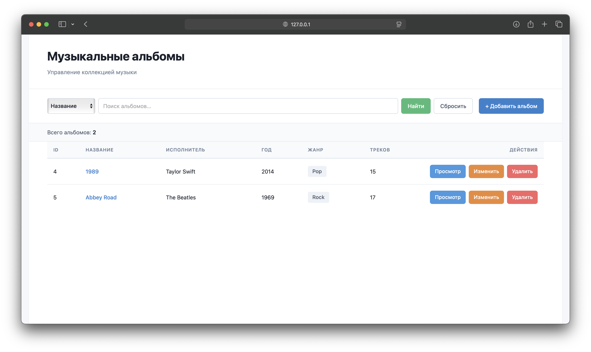

# Шаблон проекта для итоговой работы по дисциплине "Язык программирования Java"



Проект представляет из себя Spring Boot Web MVC приложение для управления коллекцией музыкальных альбомов с одной таблицей БД.

## Функциональность
- Просмотр списка альбомов
- Добавление новых альбомов
- Редакирование существующих альбомов
- Удаление альбомов
- Поиск по названию, исполнителю, жанру и году
- Валидация вводимых данных

## Структура проекта
```
src/
├── main/
│   ├── java/com/music/album/
│   │   ├── AlbumManagerApplication.java    # главный класс
│   │   ├── controller/
│   │   │   ├── AlbumController.java        # контроллер альбомов
│   │   │   └── HomeController.java         # контроллер домашней страницы
│   │   ├── entity/
│   │   │   └── Album.java                  # класс с сущностью альбома
│   │   ├── repository/
│   │   │   └── AlbumRepository.java        # репозиторий для работы с БД
│   │   └── service/
│   │       └── AlbumService.java           # бизнес-логика
│   └── resources/
│       ├── static/css/
│       │   └── style.css                   # стили приложения
│       ├── templates/albums/
│       │   ├── list.html                   # список альбомов
│       │   ├── form.html                   # форма добавления/редактирования
│       │   └── view.html                   # просмотр альбома
│       └── application.properties          # конфигурация
```

## Клонирование проекта
```bash
git clone https://github.com/DmtryG/psu-java-sample-project.git
```